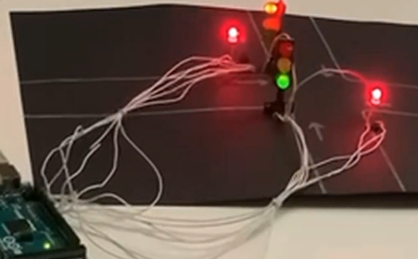

This is a program written in assembly (and some C) that simulates the traffic light system. The code was run on an Arduino Mega56.

https://biteable.com/watch/3351933/fe88089bd3ff62408d0c09103380565d "Now in Android: 55")
